# SwiftUI Animations

I'm an iOS developer. I create and post animations for fun and so people hopfully get some ideas and inspiration for their own apps!  

For more animations and code, check out my GitHub.

## GIF's and link's to the code

### Halfpipe
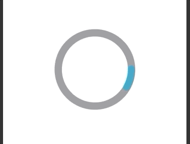
#### [Link to code](https://github.com/Chameera-de/SWIFT-UI-Animations/tree/main/Animations/HalfpipeLoading)
---
### Sticker Darkmode Button
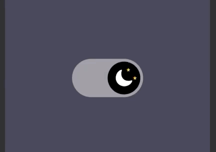
#### [Link to code](https://github.com/Chameera-de/SWIFT-UI-Animations/tree/main/Animations/DarkmodeToggle)
---
### Radar

#### [Link to code](https://github.com/Chameera-de/SWIFT-UI-Animations/tree/main/Animations/Radar)
---
### WiFi
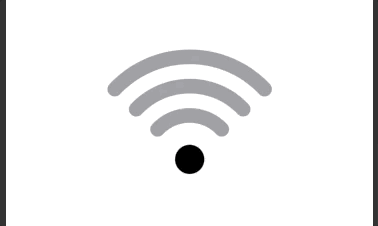
#### [Link to code](https://github.com/Chameera-de/SWIFT-UI-Animations/tree/main/Animations/Wifi)
---
### DNA Loading
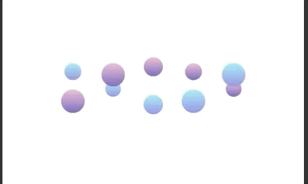
#### [Link to code](https://github.com/Chameera-de/SWIFT-UI-Animations/tree/main/Animations/DNALoading)
---
### Tab Bar
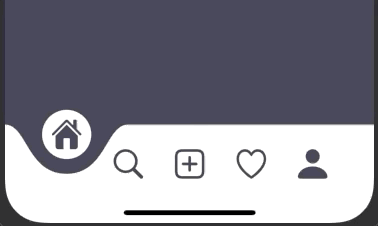
#### [Link to code](https://github.com/Chameera-de/SWIFT-UI-Animations/tree/main/Animations/TabBar)
---
### Twitter
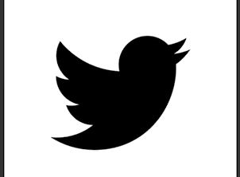
#### [Link to code](https://github.com/Chameera-de/SWIFT-UI-Animations/tree/main/Animations/ShareTwitter)
---
### CreditCardFlip

#### [Link to code](https://github.com/Chameera-de/SWIFT-UI-Animations/tree/main/Animations/CreditCardFlip)
---
### DownloadButton

#### [Link to code](https://github.com/Chameera-de/SWIFT-UI-Animations/tree/main/Animations/Download%20Button)
---
### ShareButton

#### [Link to code](https://github.com/Chameera-de/SWIFT-UI-Animations/tree/main/Animations/Share%20Button)
---
### Menu
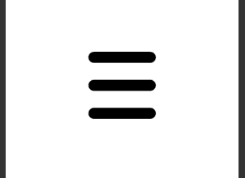
#### [Link to code](https://github.com/Chameera-de/SWIFT-UI-Animations/tree/main/Animations/Menu)
---
### Slider
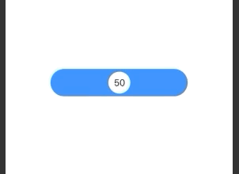
#### [Link to code](https://github.com/Chameera-de/SWIFT-UI-Animations/tree/main/Animations/Slider)
---
### Reddit

#### [Link to code](https://github.com/Chameera-de/SWIFT-UI-Animations/tree/main/Animations/Reddit)
---
### HeartLikeButton
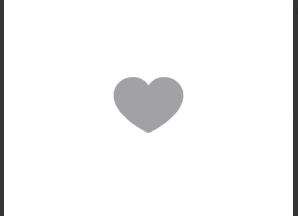
#### [Link to code](https://github.com/Chameera-de/SWIFT-UI-Animations/tree/main/Animations/HeartButton)
---
### Like Button

#### [Link to code](https://github.com/Chameera-de/SWIFT-UI-Animations/tree/main/Animations/LikeButton)
---
### Star Rating

#### [Link to code](https://github.com/Chameera-de/SWIFT-UI-Animations/tree/main/Animations/StarRating)
---
### Darkmode Button
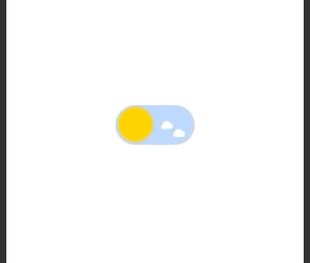
#### [Link to code](https://github.com/Chameera-de/SWIFT-UI-Animations/tree/main/Animations/DarkmodeToggle)
---
### Loading Screen
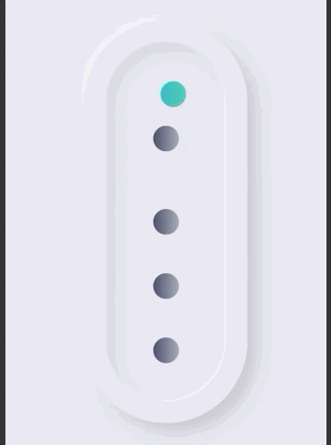
#### [Link to code](https://github.com/Chameera-de/SWIFT-UI-Animations/tree/main/Animations/LoadingScreen)
---
